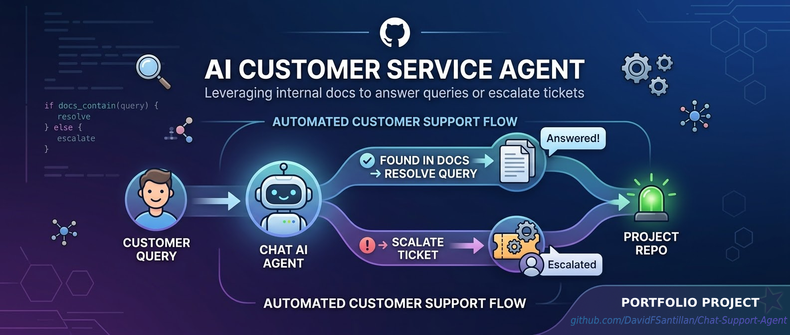
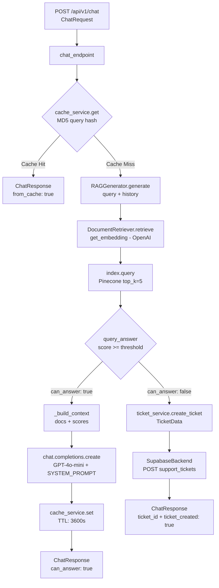

# Chat Support Agent (RAG)


Production-style customer support backend built with FastAPI, OpenAI, Pinecone, Redis, and Supabase.

The service answers user questions from internal documentation using Retrieval-Augmented Generation (RAG). If confidence is low, it automatically escalates to a support ticket workflow.

## The problem it solves

Every support team has the same issue: customers ask the same questions over and over. How do I cancel? What payment methods do you accept? How do I reset my password?
A human has to read each one, find the answer in some internal doc, and type a response. It's repetitive, slow, and expensive.
This agent handles those automatically. The tricky questions — the ones that actually need a human — get escalated to a ticket with the full conversation context already attached.

## Why This Project

This project demonstrates practical backend AI engineering patterns that are relevant for real products:

- RAG pipeline for grounded responses
- Async API design with FastAPI
- Cache-aside strategy with Redis
- Automated fallback from AI response to ticket creation
- Clean API contracts using Pydantic models
- Testable architecture with service isolation and mocks

## Architecture



## Tech Stack

- Backend: FastAPI, Uvicorn, Pydantic
- LLM: OpenAI (chat + embeddings)
- Retrieval: LangChain + Pinecone
- Caching: Redis
- Ticket persistence/integration: Supabase (plus Zendesk/HubSpot-ready service layer)
- Testing: pytest, pytest-asyncio, httpx

## Project Structure

```text
app/
  main.py                 # FastAPI app entrypoint
  api/routes.py           # API endpoints
  core/config.py          # Settings and environment config
  rag/embeddings.py       # Embedding + indexing logic
  rag/retriever.py        # Semantic retrieval
  rag/generator.py        # Response generation logic
  services/cache_service.py
  services/ticket_service.py

data/docs/                # Knowledge base documents
scripts/ingest_docs.py    # Document ingestion pipeline
tests/test_api.py         # API tests
requirements.txt
```

## Quick Start

### 1. Clone and install

```bash
git clone https://github.com/DavidFSantillan/Chat-Support-Agent.git
cd Chat-Support-Agent

python -m venv .venv
# Windows PowerShell
.\.venv\Scripts\Activate.ps1
# macOS/Linux
# source .venv/bin/activate

pip install -r requirements.txt
```

### 2. Configure environment variables

Create a `.env` file in the project root:

```env
OPENAI_API_KEY=sk-...
PINECONE_API_KEY=...
SUPABASE_URL=https://<project>.supabase.co
SUPABASE_KEY=...
REDIS_URL=redis://localhost:6379
```

### 3. Start Redis locally

```bash
docker run -d -p 6379:6379 redis:alpine
```

### 4. Ingest documentation

```bash
python scripts/ingest_docs.py
```

### 5. Run the API

```bash
uvicorn app.main:app --reload --port 8000
```

- Swagger UI: `http://localhost:8000/docs`
- Health check: `http://localhost:8000/api/v1/health`

## API Example

### Request

```bash
curl -X POST http://localhost:8000/api/v1/chat \
  -H "Content-Type: application/json" \
  -d '{
    "message": "How can I cancel my subscription?",
    "user_email": "customer@example.com",
    "user_name": "Jane Doe"
  }'
```

### Typical response

```json
{
  "conversation_id": "conv_abc123def456",
  "answer": "To cancel your subscription, go to Settings > Billing...",
  "can_answer": true,
  "sources": ["faq.md"],
  "confidence": 0.92,
  "ticket_created": false,
  "ticket_id": null,
  "from_cache": false
}
```

## Testing

```bash
pytest -m tests/ -v
```

With coverage:

```bash
pytest -m tests/ -v --cov=app --cov-report=html
```